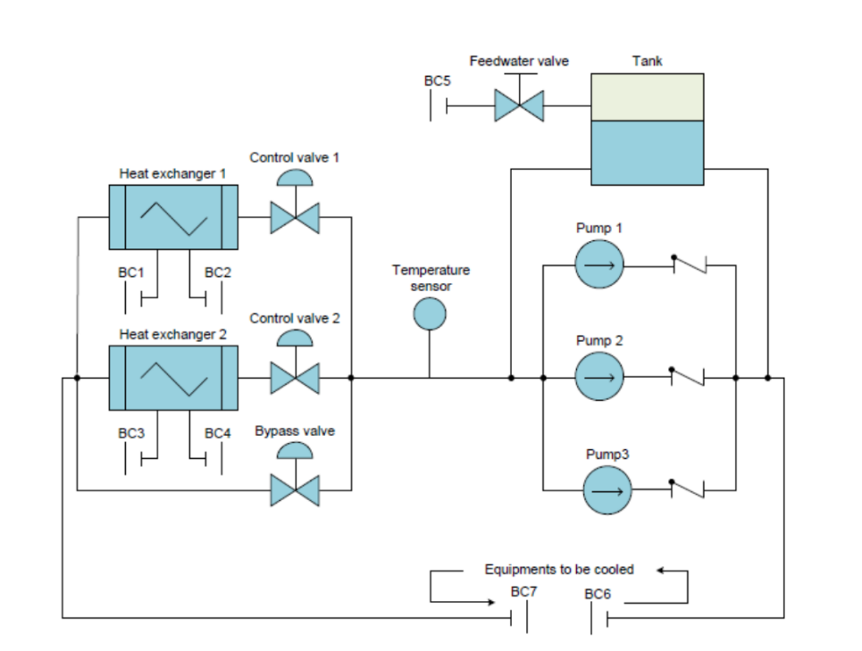
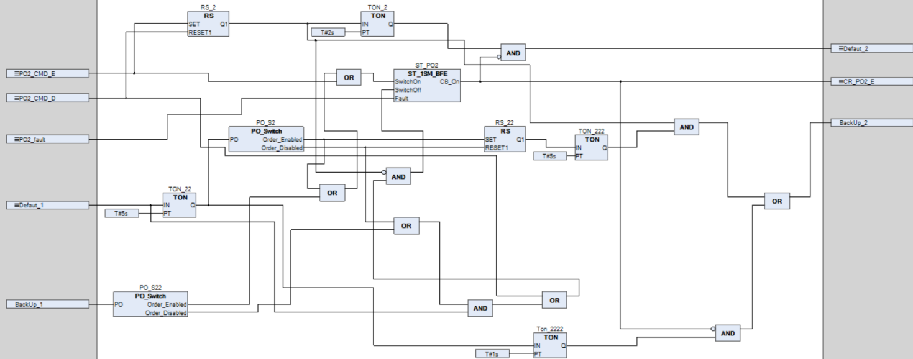
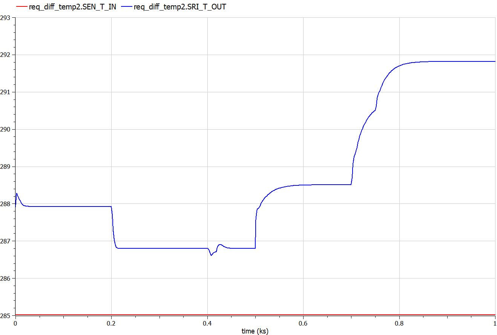

# PWR Nuclear Reactor Control System Simulation ☢️

### 🚀 Project Overview
Design and simulation of the control architecture for a **Pressurized Water Reactor (PWR)** primary circuit.
The objective was to regulate the core temperature and pressure under variable thermal load conditions while strictly adhering to safety margins (critical heat flux, overpressure protection).

**Key Focus:** System Engineering, PID Control, Safety-Critical Logic, Thermodynamics.

---

### 📊 System Architecture & Logic
*Visualizing the physical system and the decision-making algorithms.*

#### 1. Physical System Modeling
The simulation models the thermodynamic behavior of the primary loop, including heat exchangers, control valves, and circulation pumps.


#### 2. Fault Management Automaton (State Machine)
Design of the safety logic that governs the transition between **Normal Operation**, **Degraded Mode**, and **Emergency Shutdown (SCRAM)** based on sensor feedback.


---

### 🛠 Tech Stack & Methods
* **Simulation:** Modeling of thermal inertia, actuator dynamics, and fluid mechanics.
* **Control Theory:** PID Regulation (Proportional-Integral-Derivative), Feedback Loops.
* **Safety Engineering:** Implementation of redundancy and fail-safe mechanisms.

### 📈 Key Technical Challenges

#### 1. Managing Thermal Inertia
**The Problem:** The reactor core has significant thermal inertia. A simple reactive control leads to oscillations (instability).
**The Solution:** Implemented a predictive control logic using the "Average Temperature" ($T_{avg}$) trend to adjust the control rods and turbine bypass valves *before* the temperature limits were breached.

#### 2. The "Scram" Logic (Safety First)
Designed the fail-safe logic algorithm (as seen in the Automaton above):
* *Trigger:* If Pressure < $P_{min}$ OR Temperature > $T_{max}$.
* *Action:* Trigger Emergency Shutdown (SCRAM) + Activate Safety Injection System (RIS).
* *Challenge:* Modeling the transient phase to ensure the cooling of residual heat after shutdown.

#### 3. Valve Flow Linearization
Modeled the non-linear flow characteristics of the bypass valves and implemented a correction factor to linearize the system response for the PID controller.

---

### 📉 Simulation Results
**Performance Analysis:**
The graph below illustrates the system's thermal response to a load variation.
* **Red Curve:** Inlet Water Temperature ($T_{inlet}$).
* **Blue Curve:** Outlet Water Temperature ($T_{outlet}$).

**Validation:**
As observed, the controller successfully maintains the temperature differential ($\Delta T = T_{outlet} - T_{inlet}$) **below the critical 7°C threshold** throughout the transient phase. This ensures that thermal stresses on the vessel remain within the safety requirements despite the change in power load.



---

### 💻 Logic Snippet (Control Loop Concept)

*Simplified pseudocode of the regulation algorithm:*

```python
def reactor_control_loop(T_hot, T_cold, target_power):
    # 1. Acquire Data
    T_avg = (T_hot + T_cold) / 2
    error = T_ref - T_avg
    
    # 2. PID Calculation for Control Rods speed
    rod_speed = (Kp * error) + (Ki * error_sum) + (Kd * d_error_dt)
    
    # 3. Safety Check (Automaton Logic)
    if T_hot > MAX_TEMP_LIMIT:
        trigger_scram()
        return "EMERGENCY_STOP"
    
    return rod_speed
